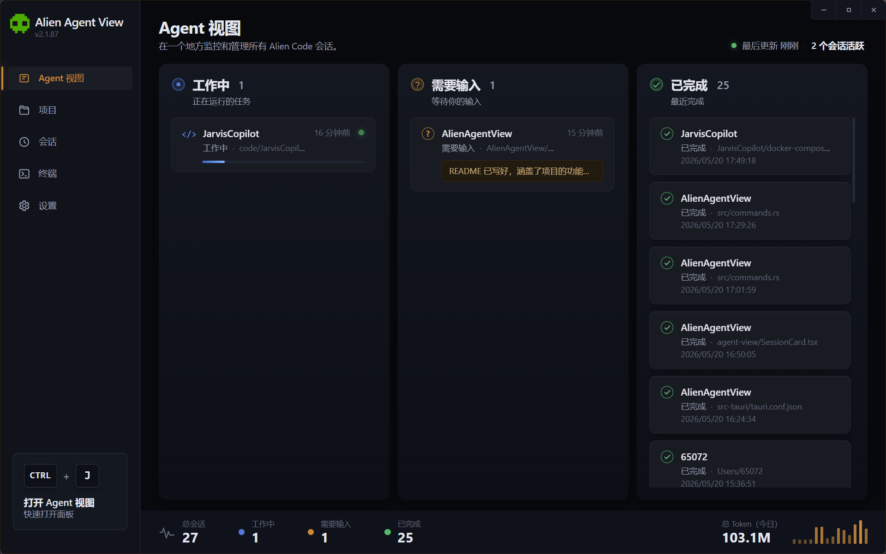

<p align="center">
  
</p>


# AlienAgentView

一个用于监控和管理 Claude Code 会话的桌面应用，基于 Tauri 2 + React + TypeScript 构建。

## 功能概览

- **Agent 看板** — 以看板 / 列表 / 网格三种视图实时展示当前活跃的 Claude Code 会话，显示项目名称、当前任务、运行状态等信息
- **终端聚合** — 利用 Windows DWM Thumbnail API 将各会话的终端窗口嵌入主界面，实现多终端统一预览与聚焦
- **会话浏览** — 按项目、日期筛选历史会话，查看会话的用户输入记录
- **项目管理** — 管理已注册项目，支持一键打开文件夹、启动/停止项目脚本、打开终端
- **使用统计** — 展示今日用量及整体统计数据
- **文件监听** — 监听 `~/.claude/` 目录变化，自动刷新会话状态
- **系统托盘** — 支持托盘图标，常驻后台运行
- **设置** — 可配置输入过滤词等偏好

## 技术栈

| 层级 | 技术 |
|------|------|
| 框架 | [Tauri 2](https://tauri.app/) |
| 前端 | React 19 + TypeScript + Vite |
| 样式 | Tailwind CSS 4 |
| 状态管理 | Zustand |
| 后端 | Rust (serde, tokio, notify, sysinfo, windows-rs) |
| 平台 | Windows（DWM 缩略图等功能依赖 Windows API） |

## 项目结构

```
├── src/                    # 前端源码
│   ├── components/
│   │   ├── agent-view/     # Agent 看板（看板/列表/网格视图）
│   │   ├── layout/         # 布局组件（侧边栏、头部、状态栏、窗口控件）
│   │   ├── projects/       # 项目管理页
│   │   ├── sessions/       # 会话浏览页
│   │   ├── settings/       # 设置页
│   │   └── terminal/       # 终端聚合页
│   ├── hooks/              # 自定义 hooks
│   ├── stores/             # Zustand 状态
│   ├── styles/             # 全局样式
│   └── types/              # TypeScript 类型
├── src-tauri/              # Tauri / Rust 后端
│   └── src/
│       ├── claude/         # Claude 会话解析（session、conversation、tasks、stats）
│       ├── commands.rs     # Tauri 命令（会话获取、窗口捕获、进程管理等）
│       ├── watcher.rs      # 文件监听器
│       ├── projects.rs     # 项目配置
│       └── app_settings.rs # 应用设置
└── public/                 # 静态资源
```

## 开发

```bash
# 安装依赖
npm install

# 启动开发模式（前端 + Tauri）
npm run tauri dev

# 构建生产包
npm run tauri build
```

## 系统要求

- Windows 10/11（核心功能依赖 Windows DWM API）
- [Claude Code CLI](https://docs.anthropic.com/en/docs/claude-code) 已安装并产生会话数据（`~/.claude/`）

## 许可证

私有项目，未公开发布。
